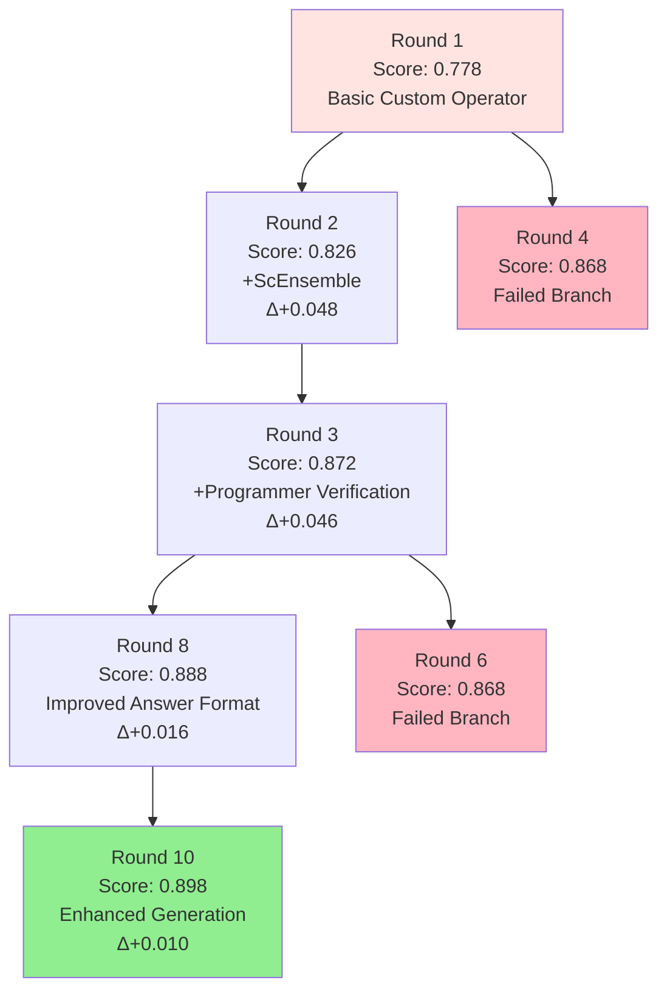

# GSM8K Workflow 演化分析报告

## 📊 演化路径概览

### 🎯 最优路径：Round 1 → Round 2 → Round 3 → Round 8 → Round 10

通过分析`processed_experience.json`，我们发现GSM8K数学问题求解的最优演化路径为：
- **Round 1** (0.778) → **Round 2** (0.826) → **Round 3** (0.872) → **Round 8** (0.888) → **Round 10** (0.898)

## 🌳 演化思维导图



## 📈 详细演化过程

### 🔰 Round 1 - 基础版本 (Score: 0.778)

**特点**：最简单的基础实现
- **操作符**：仅使用 `Custom` 操作符
- **工作流程**：直接调用LLM求解，无任何优化策略
- **提示词**：无特定的数学求解提示（注释状态）

```python
# Round 1 Graph结构
class Workflow:
    def __init__(self, name: str, llm_config, dataset: DatasetType) -> None:
        # 基础配置
        self.custom = operator.Custom(self.llm)
    
    async def __call__(self, problem: str):
        # 直接求解，无任何优化
        solution = await self.custom(input=problem, instruction="")
        return solution['response'], self.llm.cost_manager.total_cost
```

**问题**：
- 缺乏结构化的数学求解指导
- 单次生成容易出错
- 无验证机制

---

### 🚀 Round 2 - 集成策略 (Score: 0.826, +0.048)

**改进策略**：添加ScEnsemble操作符实现多解决方案选择
- **新增操作符**：`ScEnsemble` (Self-Consistency Ensemble)
- **核心创新**：生成3个解决方案，选择最一致的答案
- **提示词改进**：引入专业的数学求解提示

```python
# Round 2 新增功能
async def __call__(self, problem: str):
    solutions = []
    # 🆕 生成多个解决方案
    for _ in range(3):
        solution = await self.custom(input=problem, instruction=prompt_custom.MATH_SOLVE_PROMPT)
        solutions.append(solution['response'])
    
    # 🆕 使用集成策略选择最佳答案
    final_solution = await self.sc_ensemble(solutions=solutions, problem=problem)
    return final_solution['response'], self.llm.cost_manager.total_cost
```

**Prompt改进**：
```python
MATH_SOLVE_PROMPT = """
You are a highly skilled mathematician tasked with solving a math problem. Follow these steps:

1. Carefully read and understand the problem.
2. Identify the key information and variables.
3. Determine the appropriate mathematical concepts or formulas to use.
4. Solve the problem step by step, showing all your work.
5. Double-check your calculations and reasoning.
6. Provide a clear and concise final answer.

Remember to format your answer as follows:
- Use LaTeX notation for mathematical expressions where appropriate.
- Clearly state your final answer at the end of your solution.
- Express numerical answers as precise values (avoid rounding unless specified).
"""
```

**性能提升**：
- 分数从 0.778 → 0.826 (+6.2%)
- 通过多样性采样减少了随机错误

---

### 🔍 Round 3 - 验证机制 (Score: 0.872, +0.046)

**改进策略**：增加Programmer操作符进行结果验证
- **新增操作符**：`Programmer` (程序化验证)
- **核心创新**：对ScEnsemble的结果进行二次验证和潜在纠错
- **提示词优化**：强调答案格式的统一性

```python
# Round 3 验证流程
async def __call__(self, problem: str):
    # 生成多解决方案
    solutions = []
    for _ in range(3):
        solution = await self.custom(input=problem, instruction=prompt_custom.MATH_SOLVE_PROMPT)
        solutions.append(solution['response'])
    
    # 集成选择
    final_solution = await self.sc_ensemble(solutions=solutions, problem=problem)
    
    # 🆕 增加验证步骤
    review_result = await self.programmer(problem=problem, analysis=final_solution['response'])
    
    # 优先使用验证后的结果
    if review_result['output']:
        return review_result['output'], self.llm.cost_manager.total_cost
    else:
        return final_solution['response'], self.llm.cost_manager.total_cost
```

**Prompt改进**：
```python
# 新增答案格式要求
"""
- Ensure that your final answer is a single numerical value without any units or additional text.
"""
```

**性能提升**：
- 分数从 0.826 → 0.872 (+5.6%)
- 引入验证机制显著减少了计算错误

---

### 📝 Round 8 - 格式优化 (Score: 0.888, +0.016)

**改进策略**：专注于答案格式的精确控制
- **操作符**：保持Round 3的结构
- **核心创新**：强化答案格式约束，提供具体示例
- **问题解决**：解决答案格式不一致导致的评估错误

```python
# Round 8 代码结构与Round 3相同
# 主要改进在于Prompt的精细化调优
```

**关键Prompt改进**：
```python
MATH_SOLVE_PROMPT = """
# ... 前面内容相同 ...

Remember to format your answer as follows:
- Use LaTeX notation for mathematical expressions where appropriate.
- Clearly state your final answer at the end of your solution.
- Express numerical answers as precise values (avoid rounding unless specified).
- Ensure that your final answer is a single numerical value without any units or additional text.
- 🆕 Do not include any explanatory text with your final answer, just the number itself.

🆕 For example, if the final answer is 42.5, your response should end with just:
42.5
"""
```

**性能提升**：
- 分数从 0.872 → 0.888 (+1.8%)
- 通过格式标准化减少了因格式问题导致的错误判定

---

### ⚡ Round 10 - 增强生成 (Score: 0.898, +0.010)

**改进策略**：提高解决方案生成的多样性和质量
- **核心创新**：解决方案数量从3个增加到5个
- **验证优化**：保持强化的验证流程
- **提示词完善**：添加更详细的求解步骤指导

```python
# Round 10 关键改进
async def __call__(self, problem: str):
    solutions = []
    # 🆕 从3个增加到5个解决方案
    for _ in range(5):  # 之前是range(3)
        solution = await self.custom(input=problem, instruction=prompt_custom.MATH_SOLVE_PROMPT)
        solutions.append(solution['response'])
    
    final_solution = await self.sc_ensemble(solutions=solutions, problem=problem)
    
    # 🆕 术语优化：verification 替代 review
    verification = await self.programmer(problem=problem, analysis=final_solution['response'])
    
    if verification['output']:
        return verification['output'], self.llm.cost_manager.total_cost
    else:
        return final_solution['response'], self.llm.cost_manager.total_cost
```

**最终Prompt优化**：
```python
MATH_SOLVE_PROMPT = """
You are a highly skilled mathematician tasked with solving a math problem. Follow these steps carefully:

1. Read and understand the problem thoroughly.
2. Identify all key information, variables, and relationships.
3. Determine the appropriate mathematical concepts, formulas, or equations to use.
4. Solve the problem step-by-step, showing all your work clearly.
5. Double-check your calculations and reasoning at each step.
6. Provide a clear and concise final answer.
7. 🆕 Verify your solution by plugging it back into the original problem or using an alternative method if possible.

Format your answer as follows:
- Use LaTeX notation for mathematical expressions where appropriate.
- 🆕 Show each step of your solution process clearly.
- Clearly state your final answer at the end of your solution.
- Express numerical answers as precise values (avoid rounding unless specified).
- Ensure that your final answer is a single numerical value without any units or additional text.
- Do not include any explanatory text with your final answer, just the number itself.

For example, if the final answer is 42.5, your response should end with just:
42.5
"""
```

**性能提升**：
- 分数从 0.888 → 0.898 (+1.1%)
- 通过增加解决方案多样性进一步提高了准确率

## 📊 性能分析总结

### 🏆 最终成果
- **总体提升**：从 0.778 → 0.898 (+15.4%)
- **最优架构**：Custom + ScEnsemble + Programmer
- **关键因素**：多解决方案生成 + 集成选择 + 程序化验证

### 🎯 关键演化节点

| Round | Score | 增幅 | 关键改进 | 影响 |
|-------|-------|------|----------|------|
| 1 | 0.778 | - | 基础实现 | 建立基线 |
| 2 | 0.826 | +6.2% | ScEnsemble | 多样性采样 |
| 3 | 0.872 | +5.6% | Programmer验证 | 错误纠正 |
| 8 | 0.888 | +1.8% | 格式优化 | 标准化输出 |
| 10 | 0.898 | +1.1% | 增强生成 | 提高多样性 |

### 🔍 失败分支分析

从processed_experience.json可以看出，系统也尝试了其他优化方向但效果不佳：

- **Round 4** (0.868): 尝试额外的Programmer步骤，但可能引入了过度复杂性
- **Round 6** (0.868): 类似的问题，验证过程可能干扰了正确答案

### 🚀 成功因素
1. **多样性生成**：通过ScEnsemble提高解决方案质量
2. **智能验证**：Programmer操作符有效纠错
3. **格式标准化**：严格的答案格式要求
4. **渐进优化**：每步改进都基于前一步的成功

### 💡 设计启示
1. **组合优于单一**：多操作符协作效果更佳
2. **格式很重要**：标准化输出对评估准确性至关重要
3. **适度优化**：过度复杂化可能适得其反
4. **经验驱动**：基于失败经验的避免策略有效 